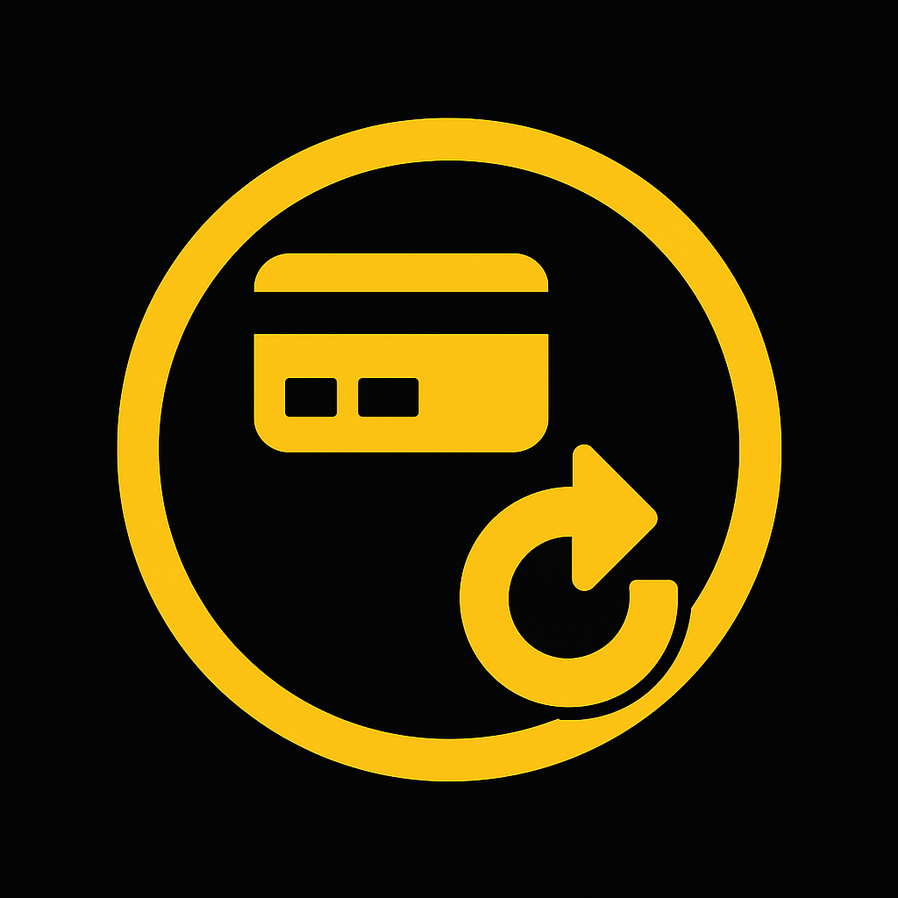

#  BinancePayConnector – Seamless Binance Pay Integration for .NET 💳🔐

[](https://www.nuget.org/packages/BinancePayConnector) [](https://www.nuget.org/packages/BinancePayConnector)

**BinancePayConnector** is a .NET library that simplifies integration with the [Binance Pay API](https://developers.binance.com/docs/binance-pay) for merchants, platforms, and service providers. It supports C2B flows like order creation, refunds, payouts, and webhook event handling — all in a strongly typed, modular, and extensible architecture.

---

> [!IMPORTANT]
> This project is not affiliated with or endorsed by Binance.

---

## ✨ Features

- Typed SDK for Binance Pay REST endpoints (Order, Refund, Payout, SubMerchant, etc.)
- DI-friendly service registration via `IServiceCollection`
- Built-in webhook receiver with multiple callback strategies
- Slim version with generic MediatR-style `Send<T>` API

---

## 📦 Installation

Install via NuGet:

```bash
dotnet add package BinancePayConnector
```

---

## 🚀 Usage

You can use BinancePayConnector in one of the following ways:

### 1. Using new BinancePay(...) (Full-featured API access)

```csharp
var binancePay = new BinancePay("your-api-key", "your-api-secret");

var response = await binancePay.Order.CreateOrder(
    new OrderIdentification(
        new Env(TerminalType.App),
        BinancePayId.Generate32().Value
    ),
    new OrderDetailsCrypto(
        "Description",
        0.001m,
        Assets.Usdt
    ),
    [
        new Goods(
            GoodsType.VirtualGoods,
            GoodsCategory.Others,
            ReferenceGoodsId: BinancePayId.Generate32().Value,
            GoodsName: "Name")
    ]
);
```

### 2. Using new BinancePaySlim(...) (Lightweight & dynamic MediatR-style API)

```csharp
var binancePay = new BinancePaySlim("your-api-key", "your-api-secret");

var response = await binancePay.Send(
    request: new CreateOrderRequest(
        Env: new Env(
            TerminalType: TerminalType.App
        ),
        MerchantTradeNo: BinancePayId.Generate32().Value,
        OrderAmount: 0.001m,
        Currency: Assets.Usdt,
        Description: "Description",
        GoodsDetails:
        [
            new Goods(
                GoodsType: GoodsType.VirtualGoods,
                GoodsCategory: GoodsCategory.Others,
                ReferenceGoodsId: BinancePayId.Generate32().Value,
                GoodsName: "Name"
            )
        ],
        OrderExpireTime: DateTimeOffset.UtcNow.AddMinutes(5).ToUnixTimeMilliseconds(),
        WebhookUrl: "https://96b4-188-163-49-145.ngrok-free.app/api/binancepay/webhooks/order"
    )
);
```

### 3. Registering via DI with .AddBinancePay(apiKey, apiSecret)

```csharp
builder.Services.AddBinancePay("your-api-key", "your-api-secret");
```

Then inject IBinancePay anywhere:

```csharp
public class OrderController(IBinancePay binancePay) : ControllerBase
{
    public async Task<IActionResult> CreateOrder()
    {
        var result = await binancePay.Order.CreateOrder(...);
        return Ok(result.Body);
    }
}
```

### 4. Registering via IConfiguration + appsettings.json

🔸 Step 1: Configuration in appsettings.json

```json
{
    "BinancePay": {
      "ApiKey": "your-api-key",
      "ApiSecret": "your-api-secret"
    }
}
```

🔸 Step 2: Register via DI

```csharp
builder.Services.AddBinancePay(builder.Configuration);
```

## 📡 Webhook Handling

Configure webhook receiver (Only 1 and 2 usage):

```csharp
var binancePay = new BinancePay(apiKey, apiSecret)
{
    WebhookConfig = new BinancePayWebhookConfig
    {
        BaseUri = "http://localhost:4421"
    }
};
```

Configure endpoint handling:

### 1 Anonymous endpoint, invokes with each webhook request
```csharp
binancePay.OnUpdateInvoke(request =>
{
    if (request.BizType is BizType.Order) return;
    var orderNotification = DeserializeJson<OrderNotification>(request.Data);

    PrintOrderNotification(request, orderNotification);
});
```

### 2 Named endpoint, invokes for concrete webhook url
```csharp
binancePay.OnUpdateInvoke(request =>
{
    if (request.BizType is not BizType.Order) return;
    var orderNotification = DeserializeJson<OrderNotification>(request.Data);

    PrintOrderNotification(request, orderNotification);
}, "api/binancepay/webhooks/order");
```

### 3 Named endpoint with response
```csharp
binancePay.OnUpdateInvoke(request =>
{
    if (request.BizType is not BizType.Balance) return ResponseType.Failure;
    var balanceReportNotification = DeserializeJson<BalanceReportNotification>(request.Data);

    PrintBalanceNotification(request, balanceReportNotification);
    return ResponseType.Success;
}, "api/binancepay/webhooks/direct-debit");
```

### 4 Asp.Net endpoint for handling webhook request
```csharp
[ApiController]
[Route("api/webhooks")]
public class WebhookController(IBinancePay binancePay) : ControllerBase
{
    [HttpPost("order")]
    public async Task<IActionResult> OrderWebHook(WebHookRequest webhook, CancellationToken ct)
    {
        if (webhook.BizType == BizType.Order)
        {
            var order = await binancePay.Order.GetOrderByPrepayId(webhook.BizIdStr, ct);
        }

        return Ok(new WebHookResponse(RequestStatus.Success));
    }
}
```

## 📦 Supported API Domains
- ✅ Order (create/query/refund/close)
- ✅ Direct Debit
- ✅ Payouts
- ✅ Sub-Merchants
- ✅ Wallet Balances
- ✅ Transfer Funds
- ✅ Share Info
- ✅ Reporting
- ✅ Webhook Callbacks


## 💖 Supporting This Project

If you find **BinancePayConnector** helpful, consider supporting its development:

- ⭐ Star the repository on GitHub
- 🐞 Report bugs and suggest features
- ☕ Donate in crypto (USDT TRC20): TEv4VqZYHajkbc4Jkg9EEr7gifcVuSQYmi

## 🤝 Contributing
PRs are welcome! Please open an issue first to discuss major changes.

## 📚 References
- [Official Binance Pay API Docs](https://developers.binance.com/docs/binance-pay)
- [Binance Developer Center](https://developers.binance.com)

---

## 📌 TODO:

### 1. Split into separate projects for better separation of concerns:
- `BinancePayConnector.Core` – shared models, enums, value types, helpers
- `BinancePayConnector` – typed service-oriented API
- `BinancePayConnector.Slim` – lightweight `Send<T>`-based variant

### 2. Replace raw primitives in response types with rich value objects:
I think do it by base virtual methods like "MapTo" in Result models for mapping to typed model
- `string PrepayId` → `BinancePayId PrepayId`
- `string QrCodeLink` → `Uri QrCodeLink`
- etc.

### 3. Enhance request models with strongly typed wrappers:
- `string Id` → `BinancePayId Id`
- `long UnixTimestamp` → `DateTime Time`
- etc.

### 4. Write end to end tests for requests

### 5. Add xml documentation to all methods and classes

### 6. Do auto chossing server depense on ping response

---
